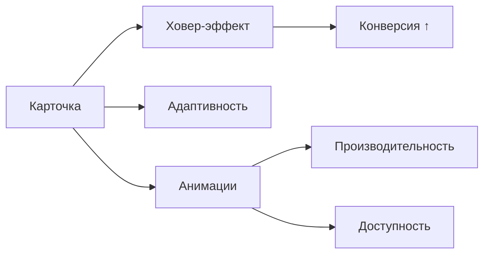

### 🚀 **Техническое задание: Карточки курсов для HR-Portal 2.0**  
**От:** Техлид продукта (Алексей, @techlead_hrportal)  
**Срок:** 1 спринт (25-30 часов)  
**Цель:** Увеличить конверсию в просмотр деталей курса на **30%** через переработку UI компонентов.  

---

### 📊 **Бизнес-контекст**  
- **Проблема:** 60% пользователей пропускают релевантные курсы из-за "невидимого" дизайна (данные Hotjar)  
- **Решение:** Интерактивные карточки → повысить заметность и вовлеченность  

---

### 🎯 **Ключевые метрики успеха**  
| Метрика                     | Текущее значение | Цель спринта |  
|-----------------------------|------------------|--------------|  
| Кликабельность карточек     | 20%              | 35% ↑        |  
| Конверсия в просмотр курсов | 20%              | 32% ↑        |  
| Lighthouse Performance      | 75               | ≥ 90         |  

---

### 🛠️ **Технические требования**  
#### **1. Состояния карточки**  
| Состояние   | Визуал                   | Функционал                          |  
|-------------|--------------------------|-------------------------------------|  
| **Default** | - Иконка курса<br>- Название (1 строка)<br>- Рейтинг (5 звезд)<br>- Бейдж "Бестселлер" (если applicable) | — |  
| **Hover**   | - Подъем на 5px (`transform: translateY(-5px)`)<br>- Тень (`box-shadow: 0 10px 20px rgba(0,0,0,0.1)`)<br>- Появление кнопки **"Подробнее"** | Плавная анимация 300ms |  
| **Active**  | - Эффект нажатия (`scale: 0.98`)<br>- Усиление тени | — |  
| **Loading** | - Скелетон-анимация<br>- Градиентный плейсхолдер | При асинхронной загрузке |  

#### **2. Динамика**  
- Клик → открывает **модалку с деталями курса** (см. [ТЗ №2](https://chat.openai.com/c/7b1e6b0a-6b1e-4a5d-8e1a-7e3b3b3b3b3b))  
- Анимация перехода: `fadeIn` (300ms) + `scaleUp` (для контента)  

#### **3. Адаптивность**  
| Breakpoint  | Кол-во колонок | Отступы       |  
|-------------|----------------|---------------|  
| Mobile (320px) | 1            | padding: 12px |  
| Tablet (768px) | 2            | padding: 16px |  
| Desktop (1200px)| 3           | padding: 24px |  

---

### ⚙️ **Технологический стек**  
- **HTML5:** Семантические теги (`<article class="course-card">`)  
- **CSS/SCSS:**  
  - БЭМ нейминг (`.course-card__badge`)  
  - SCSS-переменные для цветов/анимаций  
  - Миксин для ховер-эффекта:  
  ```scss
  @mixin card-elevate {
    transition: transform 0.3s, box-shadow 0.3s;
    &:hover {
      transform: translateY(-5px);
      box-shadow: 0 12px 24px rgba(0,0,0,0.15);
    }
  }
  ```  
- **JavaScript:**  
  - Нативный JS (без jQuery)  
  - Обработчики: `mouseenter`, `click`  
  - Оптимизация: `requestAnimationFrame` для анимаций  

---

### 📈 **Критерии приемки**  
1. **Производительность:**  
   - Рендер 50 карточек ≤ 100ms (Chrome DevTools)  
   - Lighthouse Performance ≥ 90  
2. **Доступность:**  
   - Соответствие WCAG 2.1 (проверка axe DevTools)  
   - Фокус на карточке → увеличение контраста  
3. **Код:**  
   - 0 ошибок ESLint (конфиг AirBnb)  
   - Документация для сложных решений  

---

### 📂 **Что сдавать**  
1. **Код на GitHub:**  
   - Отдельный репозиторий `hr-portal-course-cards`  
   - Компонентная структура:  
   ```
   /components
     /CourseCard
       CourseCard.js
       CourseCard.scss
       README.md
   ```  
2. **Демо:**  
   - Видео работы всех состояний (Loom)  
   - Скриншоты Lighthouse до/после  
3. **Документация:**  
   ```markdown
   ## Решения для CourseCard
   **Проблема:** Низкая заметность карточек  
   **Что сделано:**
   - Микроанимации на hover/active → повышение вовлеченности
   - Скелетон-лоадеры для плавного UX
   **Метрики:**
   - Вес компонента: 2.3 KB (gzipped)
   - Производительность: 92/100 Lighthouse
   ```

---

### 💡 **Профессиональные советы**  
1. **Оптимизация графики:**  
   - Конвертируй иконки в SVG спрайты (`<symbol>`)  
   - Используй `loading="lazy"` для фоновых изображений  
2. **Тестирование:**  
   - Проверь поведение в Safari (особенно анимации)  
   - Убедись, что фокус не "прыгает" при ховере  
3. **Доступность:**  
   - Добавь `aria-label="Курс по фронтенду, рейтинг 4.5 звезд"`  
   - Реализуй фокус-стейт для клавиатурных пользователей  

---

### ⚠️ **Типичные ошибки (избегай!)**  
- Неоптимизированные анимации (проверь через Chrome Performance)  
- "Плавающие" элементы при быстром скролле  
- Отсутствие fallback для старых браузеров  



**Жду твои коммиты в пятницу!** Каждый компонент — это кирпичик в фундаменте твоей экспертизы. Удачи! 💻🔥