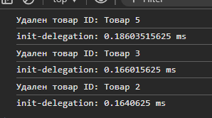
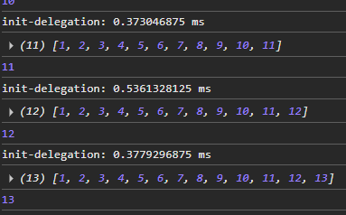
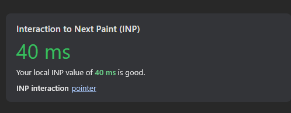

## Делегирование событий

#### - [Пример кода](./script.js)

 
**Контекст:** Динамическая таблица товаров с индивидуальными кнопками удаления
**Решение:** 
- Единый обработчик на таблице через делегирование событий
- Точечное определение кнопки через `e.target.closest()`  
- Автоматическая работа с динамически добавляемыми элементами

**Преимущества:**  
- время удаления элемента: до 0.19ms

- время добавления элемента до 0.5ms

- Инициализация: INP для операций 40ms, независимо от числа элементов

- Решение на 20 строк